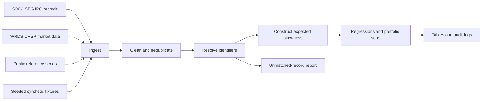

# IPO Lottery Allocation

[](https://github.com/youngnaejun/ipo-lottery-allocation/actions/workflows/tests.yml)

## Research question

This project asks whether investor demand for lottery-like payoffs affects IPO
offer prices and the allocation of capital in the US primary market. An IPO is a
firm's first sale of shares to public investors; its lottery-like character is
measured using the asymmetry of recent returns among listed firms in the same
industry. Preliminary analysis of the licensed 1975–2024 research sample finds
that higher expected skewness is associated with higher first-day returns and
lower long-run buy-and-hold returns. The public repository demonstrates the
data contracts and computational workflow with synthetic records; it does not
distribute the observations used to estimate those results.

## Data sources

| Provider | Product | Coverage used | Access method |
|---|---|---:|---|
| LSEG | SDC Platinum / Workspace new issues | 1975–2024 | Institutional subscription and local export |
| WRDS | CRSP stock files | 1975–2024 | Authenticated WRDS connection |
| Jay Ritter | IPO age and related reference files | Varies by file | Public research data download |
| Kenneth French | 30 Industry Portfolios | 1975–2024 | Public data-library download |
| University of Michigan / FRED | Consumer Sentiment Index | 1975–2024 | Public download/API |
| Baker and Wurgler | Investor sentiment series | Available historical coverage | Public research data download |

**Licensed data are not distributed with this repository.** CRSP, SDC/LSEG and
other restricted records must be obtained under the user's own institutional
licences. Generated fixtures reproduce the required schema and selected edge
cases without reproducing a vendor observation.

## Architecture



SAS is the authoritative production data-engineering environment. Stata is used
for the current journal regressions and tables. The Python package supplies a
portable, testable implementation of the key stage contracts so CI and Docker
can validate behaviour without licensed data. See
[`docs/architecture.md`](docs/architecture.md) for the contracts and row-count
checkpoints.

## Quickstart with synthetic data

Python 3.11 or 3.12 is required.

```bash
git clone https://github.com/youngnaejun/ipo-lottery-allocation.git
cd ipo-lottery-allocation
python -m venv .venv
```

Activate the environment (`.venv\Scripts\activate` on Windows or
`source .venv/bin/activate` on macOS/Linux), then run:

```bash
python -m pip install --upgrade pip
pip install -e ".[dev]"
python tests/fixtures/make_synthetic.py --output-dir data/synthetic
python -m ipo_lottery run --stage all
```

The command creates a cleaned IPO file, a linked file, an explicit unmatched
report, feature-complete records and an allocation summary under the ignored
`data/processed/` directory. Individual checkpoints can be run with `--stage
clean`, `--stage link`, `--stage features` or `--stage analysis`.

## Repository layout

```text
config/                 Sample rules, thresholds and local paths
docs/                   Architecture and production-code notes
src/ipo_lottery/        Portable Python pipeline and command-line interface
src/sas/                Authoritative licensed-data engineering programs
src/stata/              Current empirical-analysis programs
tests/fixtures/          Seeded synthetic-data generator
tests/                   Behavioural and end-to-end tests
.github/workflows/      Python 3.11/3.12 continuous integration
```

## Testing

```bash
ruff check src tests
python -m ipo_lottery.audit
pytest -q --cov=src/ipo_lottery --cov-report=term-missing
```

The suite checks exact sample filters, deterministic handling of duplicate
issuer-date share classes, failure on missing required fields, highest-score
CUSIP resolution, explicit unmatched-record reporting, a known
expected-skewness value, the lottery threshold boundary and a complete synthetic
run. CI also fails if Git tracks a vendor-data format or a credential file. The
duplicate share-class test represents an edge case encountered during
construction of the research data.

## Reproducing with licensed data

1. Obtain authorised SDC/LSEG and WRDS access; do not place credentials in code.
2. Copy `.env.example` to `.env`, set `WRDS_USERNAME` and point
   `IPO_LOTTERY_ROOT` to a local workspace outside version control.
3. Place authorised inputs beneath that workspace's `raw/` directory.
4. Run the documented SAS stages in `src/sas/`, followed by the current Stata
   analysis in `src/stata/`.

Expected saved checkpoints are approximately 12,936 cleaned SDC deals, 9,400
CRSP matches, 8,924 observations in the analysis universe and 8,923 in the
analysis dataset after the confirmed issuer exclusion. Counts can change if
vendors revise historical data, so each run should retain its audit log. Runtime
depends on WRDS load, SAS configuration and local hardware and has not yet been
benchmarked on a clean external machine.

## Docker

The container runs only the synthetic workflow:

```bash
docker build -t ipo-lottery-allocation .
docker run --rm ipo-lottery-allocation
```

No credentials or host data are copied into the image. Mount licensed inputs
only in an authorised private environment.

## Status

Public research-software release: the synthetic Python pipeline, tests and
sanitised SAS/Stata snapshot are available. GitHub Actions tests Python 3.11 and
3.12 and independently builds the Docker image and runs the synthetic pipeline
inside the container.

## Licence and citation

Code is released under the [MIT Licence](LICENSE). Citation metadata are in
[`CITATION.cff`](CITATION.cff). Data remain subject to their providers' terms.
